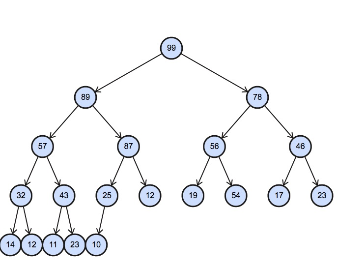
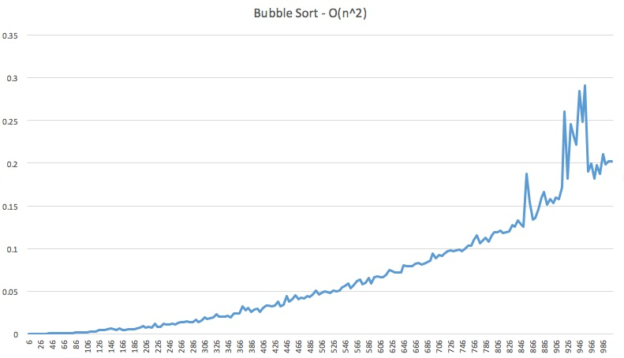
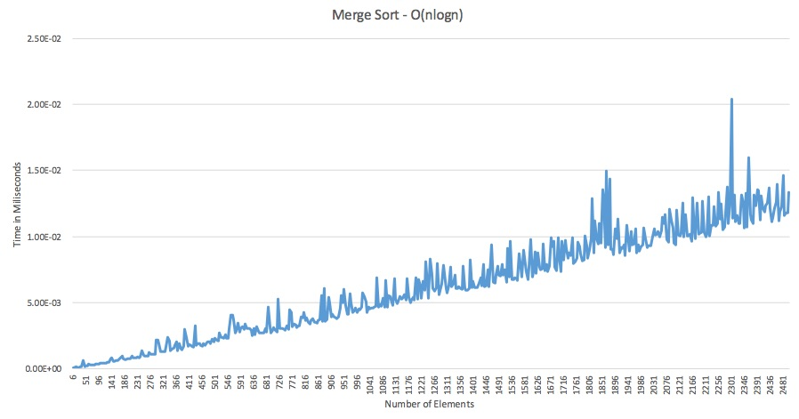
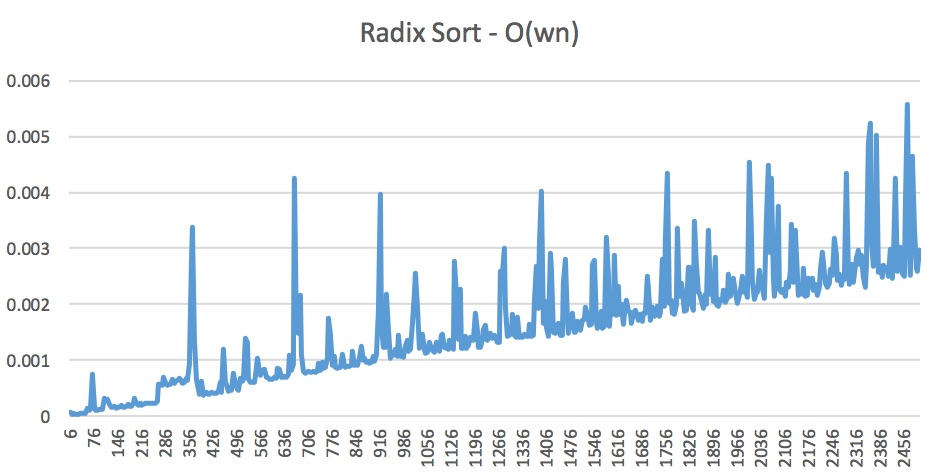

<center><h1 style="margin-top:0px">Homework #2 </h1><center>
<center><h2 style="margin-top:0px">CSE 7350</h2><center>
<center><h2 style="margin-top:0px">Erik Gabrielsen</h2><center>

<br>
#### 1. Sorting algorithms
1. Bubble Sort - a simple sorting algorithm that sorts a list by repeatedly stepping through the list, comparing two adjacent items, and swapping the items if they are out of order. Once the algorithm passes through the list without having to swap any two items, the algorithm is sorted. A relatively slow sorting algorithm and not used much when the number of items in large.

2. Insertion Sort - works by iterating over the first item, then comparing the current item to the item to the left, which happens to be the largest item in the left portion of the list. If the number is greater it remains in place, if the number is smaller, the algorithm takes the number and inserting it in the correct location by comparing each element in the left portion of the array. This repeats until the last element in the array is reached.

3. Selection Sort - sorts a list from left to right by dividing the list into a left and right sublist. Starting with index 0, the algorithm iterates through the list and finds the smallest item in the list and replaces it with index 0. Then the right sublist bounds move 1 to the right. This process repeats, finding the smallest element in the right sublist and appending it at the end of the left sublist until the list is sorted.

4. Heap Sort - Similar to Selection sort, heap sort sorts a list of elements by finding the maximum element of the list and placing it at the end, and repeating this process of searching and placing at the beginning of the right sorted sublist. The key difference though is that searching for the element takes log(n) time as it first places the elements into a heap data structure.

5. Quick Sort - Quick sort works by partitioning the list at a "pivot" point and placing everything that is less than the element to the left and greater then to the right. Then we recursively perform these steps on the smaller sub arrays until we are left with a sorted array.

6. Merge Sort - Merge sort is a divide and conquer algorithm like quick sort that divides an array into n sub arrays with length 1. Then it recursively merges the sub arrays back into smaller sorted arrays until you are left with one sorted array.

7. Radix Sort - works by grouping data by individual digits that share a position and value. For instance, in an array of numbers with multiple bits, it groups the numbers by the least significant bit first, then recursively groups them based on the next significant figure until it reaches the most significant figure, and the array is sorted.  

8. Bucket Sort - a sorting algorithm that sorts by placing elements of an array into buckets which hold elements of similar types. Each bucket is then sorted individually and then the buckets are iterated over in order and put back together into a sorted list.

#### 2. Average, and Worst Case

|   | Average Case | Worst Case |  Notes |
|:----------:|:-------------:|:------:|
| Bubble Sort |  O(n<sup>2</sup>) | O(n<sup>2</sup>) | |
| Insertion Sort |    O(n<sup>2</sup>)   |   O(n<sup>2</sup>) | |
| Selection Sort | O(n<sup>2</sup>)  |    O(n<sup>2</sup>)  | |
| Heap Sort | O(n•log(n))  |   O(n•log(n))  | |
| Quick Sort | O(n•log(n)) |    O(n<sup>2</sup>)  |  Quick sort runs in O(n<sup>2</sup>) when elements are already sorted or are always the same. This is usually rare and is why average case is O(n•log(n)) |
| Merge Sort | O(n•log(n))  | O(n•log(n)) | |
| Radix Sort | O(wn)  |    O(wn)  | where w is the word size |
| Bucket Sort | O(n + k)  |    O(n<sup>2</sup>)  | On average bucket sort runs at O(n + k): with k number of buckets and n number of elements. Its worst case is O(n<sup>2</sup>) based on the edge case where bucket sort places every element in the same bucket.

#### 3. Average and Worst Case for insert, search, and delete

|   |  Insert (average) | Insert (worst) | Search (average) |  Search (worst) | Delete (average) | Delete (worst) |
|:----------:|:-------------:|:------:|:------:|:-----:|:-----:|:-----:|
| Array | O(n) | O(n) | O(n) | O(n) | O(n) | O(n) |
| Sorted Array | O(n) | O(n) | O(1) | O(1) | O(n) | O(n) |
| Linked List | O(1) | O(1) | Θ(n) | Θ(n) | Θ(1) | Θ(1) |
| Sorted Linked list |  O(1) | O(1) | Θ(n) | Θ(n) | Θ(1) | Θ(1) |
| Binary Search Tree | Θ(log(n)) | Θ(n) | Θ(log(n)) | Θ(n) | Θ(log(n)) | Θ(n) |
| AVL Tree | Θ(log(n)) | O(log(n)) | Θ(log(n)) | O(log(n)) | Θ(log(n)) | O(log(n)) |
| Heap | O(1) | O(log(n)) | O(n) | O(n) | O(log(n)) | O(log(n)) |

#### 4. Heapify the Array

There were 6 swaps total. The final heap looks like the following. I worked this out on paper than put it into an online generator to make the chart look prettier than anything I could draw.



#### 5. A D-ary Heap

A d-Ary heap as an array if we had an array `A` would be as follows:

`A[1]` is the head and its children would be `A[2], A[3], A[4],....A[d+1]` and the children of `A[2]` would be `A[d + 2], A[d + 3],...A[2d + 1]` and so on.

The children of an element at index `i` can be written as:
`Children of i = A[(d - 1)i + 2], A[(d - 1)i + 3], .... A[di + 1]`

The parent of any element at index `i` would be: `A[(i - 1)/d]`

The number of levels `l` in the heap is at most <code>d<sup>l</sup></code>. The number of nodes in a tree of height `l` is <code>1 + d + ... + d<sup>l</sup> = Θ(d<sup>l</sup>)</code>. Therefore if the number of nodes n = <code>Θ(d<sup>l</sup>) </code> the height is <code>Θ(log<sub>d</sub>n)</code>

#### 6. Hash Function
Rather than using linked lists as a collision technique which takes O(n) worst case to search, we can instead use Open Addressing. Open Addressing fills the entire hash table with values and rather than keeping a linked list, it adds the collided element to some other index in the hash table. To search, we simply compute the hash by taking an input and a key. This is not usually practiced because Deletion is very difficult.

#### 7. Sorting Methods
Here is my implementations for sorting. I chose Bubble sort for O(n<sup>2</sup>) algorithm, Merge sort for O(nlogn) algorithm, and Radix sort for my O(n) algorithm.

```
#! /usr/bin/ruby

class Array
  # implementation based on https://rosettacode.org/wiki/Sorting_algorithms/Radix_sort
  def radix_sort(base=10)
    ary = dup
    rounds = (Math.log(ary.minmax.map(&:abs).max)/Math.log(base)).floor + 1
    rounds.times do |i|
      buckets = Array.new(2*base){[]}
      base_i = base**i
      ary.each do |n|
        digit = (n/base_i) % base
        digit += base if 0<=n
        buckets[digit] << n
      end
      ary = buckets.flatten
      p [i, ary] if $DEBUG
    end
    ary
  end
  def radix_sort!(base=10)
    replace radix_sort(base)
  end
end

def bubble_sort(array)
  n = array.length
  loop do
    swapped = false

    (n-1).times do |i|
      if array[i] > array[i+1]
        array[i], array[i+1] = array[i+1], array[i]
        swapped = true
      end
    end

    break if not swapped
  end

  array
end

#implementation based from https://www.sitepoint.com/sorting-algorithms-ruby/
def mergesort(array)
  def merge(left_sorted, right_sorted)
    res = []
    l = 0
    r = 0

    loop do
      break if r >= right_sorted.length and l >= left_sorted.length

      if r >= right_sorted.length or (l < left_sorted.length and left_sorted[l] < right_sorted[r])
        res << left_sorted[l]
        l += 1
      else
        res << right_sorted[r]
        r += 1
      end
    end

    return res
  end

  def mergesort_iter(array_sliced)
    return array_sliced if array_sliced.length <= 1

    mid = array_sliced.length/2 - 1
    left_sorted = mergesort_iter(array_sliced[0..mid])
    right_sorted = mergesort_iter(array_sliced[mid+1..-1])
    return merge(left_sorted, right_sorted)
  end

  mergesort_iter(array)
end

num = 1
numbers = []
200.times do
  num = num + 5
  numbers << num
end

file1 = File.open('./radix_sort_results.csv', 'w')
file2 = File.open('./bubble_sort.csv', 'w')
file3 = File.open('./mergesort.csv', 'w')
numbers.each do |n|
  data =* (1..(2*n))
  data.shuffle!.slice!(0, n)

  t1 = Time.now
  sorted_arr = data.radix_sort
  t2 = Time.now
  delta = t2 - t1 # in seconds
  file1.write("#{n}, #{delta}\n")

  t1 = Time.now
  sorted_arr = mergesort(data)
  t2 = Time.now
  delta = t2 - t1 # in seconds
  file3.write("#{n}, #{delta}\n")

  t1 = Time.now
  sorted_arr = bubble_sort(data)
  t2 = Time.now
  delta = t2 - t1 # in seconds
  file2.write("#{n}, #{delta}\n")
  puts n
end
```

Here are the results of each sorting algorithm on the data.






