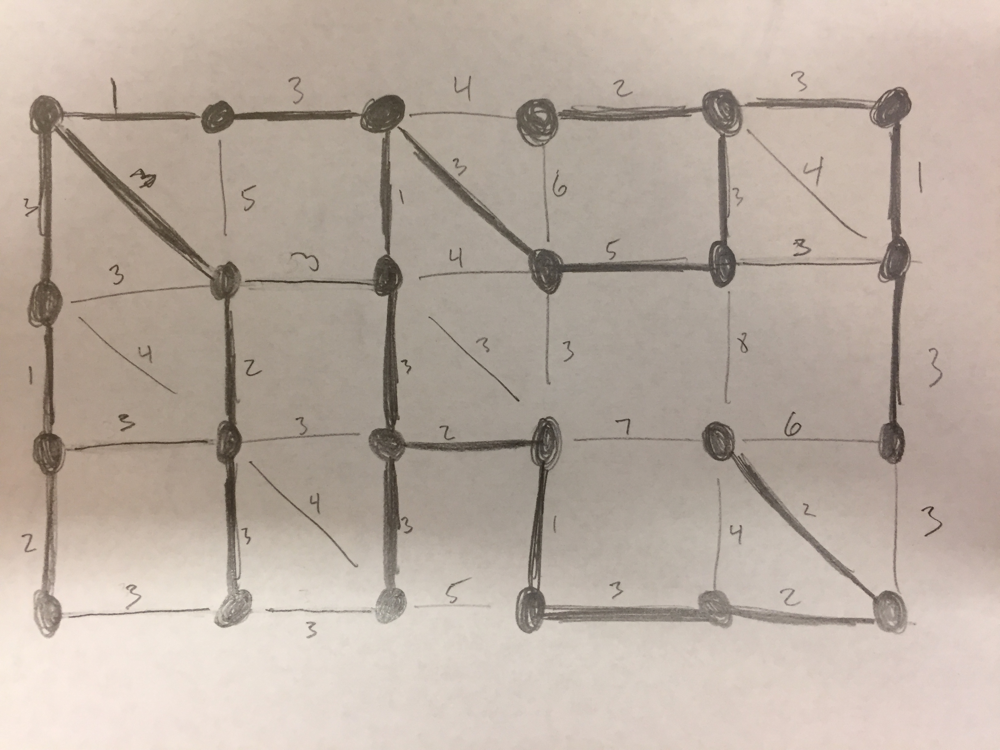
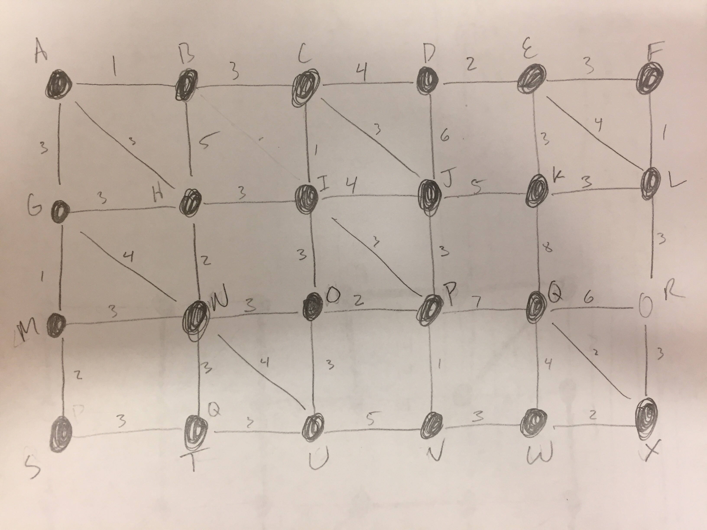
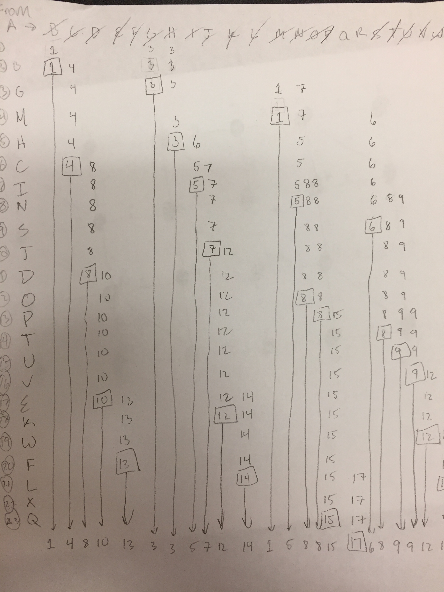

<h1 style="margin-top:0px">Homework #3 </h1>

<h2 style="margin-top:0px">CSE 7350</h2>

<h2 style="margin-top:0px">Erik Gabrielsen</h2>

 
#### 1. Huffman Encoding
  1. `ABCD` would yield this Huffman encoding. `A: 01  B:00 C:10` and `D:11`, so if D was included then yes. If ABC is the limit of the alphabet than this would not be the case as the most frequent letter would have a 1 or 0 as its encoding.
  2. `A -> 1, B -> 1, C -> 1`
  3. `ABCD` would yield this Huffman encoding. `A: 01  B:00 C:10` and `D:11` so frequencies of the following `A -> 1, B -> 1, C -> 1, D -> 1`
  4. This would be invalid because the decoder would not be able to tell if `11` is `C` or if it is `BB`

  For an alphabet of 4 symbols, the minimum frequency need to have a 1-bit encoding would be 1. If the symbol frequency is `A:1, B:1, C:1, D:0` the Huffman encoding would be `A:0, B:11, C:101, D: 100`

#### 2. "Smallest-Last" Vertex ordering
  One possible ordering would be `H, G, A, F, B, C, D, E`.

  The maximum number of colors needed would be 1 color per node, or 7 colors. The minimum number of needed would be 4 colors

#### 3. Euler Tour
  `Kn` has a Euler Tour at every value of `n` that is odd. In other words:
  `Kn is Euler Tour if n % 2 == 1 for n > 1`

#### 4. Bipartite Graph
  For the cycle `Cn` to be bipartite `n` must be an even number: `Cn is bipatrtite if n % 2 == 0 for n > 1`

#### 5. Minimum Spanning Tree
  For this I used Kruscal's algorithm. Here is the Tree:

  

  The weight of the minimum spanning tree is `57`

#### 6. Minimum Cost
  I can get to the following nodes at a minimum of the following costs by using Dijkstra's algorithm.

  | Node | Min Cost |
  |:--:|:--:|
  | B | 1 |
  | C | 4 |
  | D | 8 |
  | E | 10 |
  | F | 13 |
  | G | 3 |
  | H | 3 |
  | I | 5 |
  | J | 7 |
  | K | 12 |
  | L | 14 |
  | M | 1 |
  | N | 5 |
  | O | 8 |
  | P | 8 |
  | Q | 15 |
  | R | 17 |
  | S | 6 |
  | T | 8 |
  | U | 9 |
  | V | 9 |
  | W | 12 |
  | X | 14 |

  

  These are the vertices that I used for the graph.

  

  This is the algorithm technique I used to solve for shortest distance to all nodes
