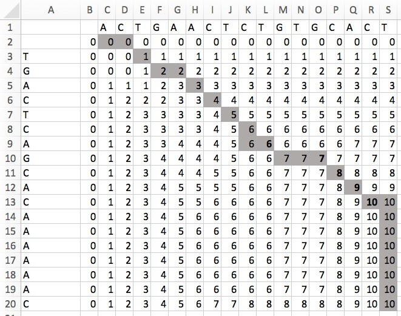

<center><h1 style="margin-top:0px">Homework #4 </h1><center>
<center><h2 style="margin-top:0px">CSE 7350</h2><center>
<center><h2 style="margin-top:0px">Erik Gabrielsen</h2><center>

<br>
#### 1. Recursive Fibonacci
```
def fib_rec(n)
  n <= 1 ? 1 :  fib_rec( n - 1 ) + fib_rec( n - 2 )
end
```

| N | Running Time |
|:----------:|:-------------:|
|1| 2.0e-06|
|2| 1.0e-06|
|3| 1.0e-06|
|4| 1.0e-06|
|5| 2.0e-06|
|6| 2.0e-06|
|7| 3.0e-06|
|8| 4.0e-06|
|9| 1.3e-05|
|10| 1.2e-05|
|11| 1.9e-05|
|12| 2.9e-05|
|13| 9.4e-05|
|14| 0.000129|
|15| 0.000124|
|16| 0.000232|
|17| 0.000355|
|18| 0.000559|
|19| 0.000886|
|20| 0.001376|


#### 2. Fibonacci Continued
##### Iterative Fibonacci
```
def fib_it(n, sequence=[1])
  n.times do
    current_number, last_number = sequence.last(2)
    sequence << current_number + (last_number or 0)
  end

  sequence.last
end

```

| N | Running Time |
|:----------:|:-------------:|
|1| 1.2e-05|
|2| 3.0e-06|
|3| 2.0e-06|
|4| 3.0e-06|
|5| 3.0e-06|
|6| 3.0e-06|
|7| 4.0e-06|
|8| 3.0e-06|
|9| 7.0e-06|
|10| 7.0e-06|
|11| 5.0e-06|
|12| 5.0e-06|
|13| 1.0e-05|
|14| 6.0e-06|
|15| 6.0e-06|
|16| 6.0e-06|
|17| 6.0e-06|
|18| 7.0e-06|
|19| 6.0e-06|
|20| 8.0e-06|


##### Table lookup

```
fib = Hash.new do |f, n|
  f[n] = if n <= -2
           (-1)**(n + 1) * f[n.abs]
         elsif n <= 1
           1
         else
           f[n - 1] + f[n - 2]
         end
end
```

| N | Running Time |
|:----------:|:-------------:|
| 1|3.0e-06|
| 2|2.0e-06|
| 3|1.0e-06|
| 4|1.0e-06|
| 5|1.0e-06|
| 6|3.0e-06|
| 7|2.0e-06|
| 8|1.0e-06|
| 9|2.0e-06|
| 10|5.0e-06|
| 11|2.0e-06|
| 12|2.0e-06|
| 13|3.0e-06|
| 14|3.0e-06|
| 15|3.0e-06|
| 16|2.0e-06|
| 17|2.0e-06|
| 18|3.0e-06|
| 19|2.0e-06|
| 20|4.0e-06|


#### 3. Longest Common Subsequence

<br>
The longest common subsequence is TGACTCGCAC.

#### 4. Dice
| Value | Dice 1 | Dice 2| Dice 3 |
|:----------:|:-------------:|:-------------:|:-------------:|
| 0| 0 | 0|0 |
| 1| 1 | 0|0 |
| 2| 2| 3|0 |
| 3| 2| 6|9 |
| 4| 1| 7|24 |
| 5| 0| 7|39 |
| 6| 0| 6|41 |
| 7| 0| 5|39 |
| 8| 0| 2|34 |
| 9| 0| 0|22 |
| 10| 0| 0|9 |

 a. How many of the rolls will sum to the value of 6: 41
 <br>b. How many of the rolls will sum to the value of 7: 39
 <br>c. How many of the rolls will sum to the value of 8: 34
 <br>d. How many of the rolls will sum to the value of 9: 22
 <br>e. How many of the rolls will sum to the value of 10: 9


#### 5. Extended Euclidian Algorithm
| A | B | Q| R | alpha| beta |
|:----------:|:-------------:|:-------------:|:-------------:|:-------------:|:-------------:|
| | | | | 1 | 0 |
| 12103| 9889 |1 |2214 |0 |1 |
| 9889| 2214 |4 |1033 |1 |-1 |
| 2214| 1033 |2 |148 |-4 |5 |
| 1033| 148 |6 |145 |9 |-11 |
| 148| 145 |1 |3 |-58 |71 |
| 145| 3 |48 |1 |67 |-82 |
| 3| 1 |3 |0 |-3274 |4007 |
| 1| 0 |- |- |9889 |-12103 |

Since 4007\*9889 + (-3274)\*12103 = 1 then,<br>
4007\*9889 = (3274)\*12103 + 1 and therefore,<br>
4007\*9889 = 1 modulo 12103<br>
So 1/9889 = 4007 modulo 12103<br>

#### 6. 0-1 Knapsack
The correct solution would be to take Job 1 and Job 3 for Processor 1 which would take up the full 10 seconds.

| -- | Job 1 | Job 2| Job 3 | Job 4 |
|:----------:|:-------------:|:-------------:|:-------------:|
| 0| 0| 0| 0| 0|
| 1| 0| 0| 0| 0|
| 2| 0| 0| 0| 0|
| 3| 0| 0| 0| 0|
| 4| 4| 4| 4| 4|
| 5| 4| 5| 5| 5|
| 6| 4| 5| 6| 6|
| 7| 4| 5| 6| 7|
| 8| 4| 5| 6| 7|
| 9| 4| 9| 9| 9|
| 10|4 |9 |10 | 10|

#### Appendix - Code for 1 & 2
```
## Adapted from Rosetta Code

def fib_rec(n)
  n <= 1 ? 1 :  fib_rec( n - 1 ) + fib_rec( n - 2 )
end

def fib_it(n, sequence=[1])
  n.times do
    current_number, last_number = sequence.last(2)
    sequence << current_number + (last_number or 0)
  end

  sequence.last
end

fib = Hash.new do |f, n|
  f[n] = if n <= -2
           (-1)**(n + 1) * f[n.abs]
         elsif n <= 1
           1
         else
           f[n - 1] + f[n - 2]
         end
end

nums = [1, 2, 3, 4, 5, 6, 7, 8, 9, 10, 11,
12, 13, 14, 15, 16, 17, 18, 19, 20, 30]

nums.each do |n|
  start_time = Time.now
  fib_rec(n)
  end_time = Time.now
  # puts n

  start_time = Time.now
  # fib_it(n)
  puts fib[10]
  end_time = Time.now
  # puts end_time - start_time
end
```
